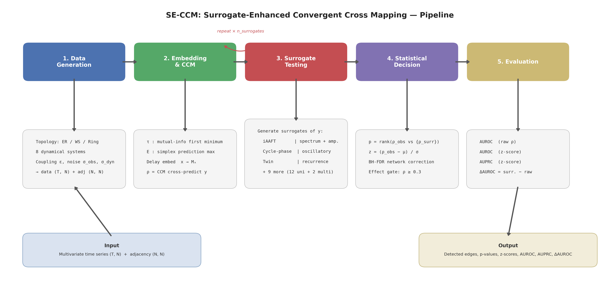

# SE-CCM: Surrogate-Enhanced Convergent Cross Mapping

[](https://www.python.org/downloads/)
[](LICENSE)

**[中文文档 / Chinese Documentation](docs/README_zh.md)**

SE-CCM is a Python framework for statistically rigorous **causal inference in coupled dynamical systems**. It extends the Convergent Cross Mapping (CCM) algorithm ([Sugihara et al., 2012, *Science*](https://doi.org/10.1126/science.1227079)) with surrogate-based hypothesis testing, turning raw cross-map correlations into principled statistical decisions.

---

## Key Idea

CCM detects causal relationships by exploiting **Takens' embedding theorem**: if variable Y causally drives X, then Y's information is encoded in X's reconstructed attractor, and a shadow manifold built from X can cross-predict Y.

**The problem:** raw CCM correlation (ρ) is susceptible to false positives from shared dynamics, synchronization, or finite-sample bias.

**SE-CCM's solution:** generate surrogate time series of the candidate cause under the null hypothesis of no causal influence. Compare the observed ρ against the surrogate distribution to obtain p-values and z-scores, then apply FDR correction for network-wide testing.

<p align="center">

</p>

## Features

- **7 coupled dynamical systems** — Logistic, Lorenz, Henon, Rossler, Hindmarsh-Rose, FitzHugh-Nagumo, Kuramoto
- **5 surrogate methods** — FFT, AAFT, iAAFT, time-shift, random reorder
- **Automatic embedding** — data-driven selection of embedding dimension (E) and delay (tau) via mutual information and simplex prediction
- **Network-scale testing** — pairwise CCM with Benjamini-Hochberg FDR correction
- **6 experiment modules** — bivariate validation, coupling strength sweep, noise robustness, topology comparison, surrogate method comparison, robustness ablation study
- **Publication-ready output** — 300 DPI figures (PDF + PNG), LaTeX tables, CSV data

## Installation

```bash
git clone https://github.com/your-username/surrogate-ccm.git
cd surrogate-ccm
pip install -e .
```

Or install dependencies directly:

```bash
pip install -r requirements.txt
```

**Requirements:** Python >= 3.9, NumPy, SciPy, scikit-learn, NetworkX, matplotlib, seaborn, joblib, h5py, PyYAML, tqdm, statsmodels.

## Quick Start

### Minimal Example

```python
from surrogate_ccm.generators import generate_network, create_system
from surrogate_ccm.testing import SECCM

# Create a 10-node coupled Lorenz network
adj = generate_network("ER", N=10, seed=42, p=0.3)
system = create_system("lorenz", adj, coupling=1.0)
data = system.generate(T=3000, transient=1000, seed=42)  # shape: (3000, 10)

# Run SE-CCM
seccm = SECCM(surrogate_method="aaft", n_surrogates=99, alpha=0.05, fdr=True)
seccm.fit(data)

# Evaluate against ground truth
metrics = seccm.score(adj)
print(f"AUROC (surrogate): {metrics['AUC_ROC_surrogate']:.3f}")
print(f"AUROC (raw rho):   {metrics['AUC_ROC_rho']:.3f}")
print(f"Delta AUROC:       {metrics['AUC_ROC_delta']:+.3f}")
```

### Run Experiments

```bash
# Run all experiments with default config
python run_experiments.py --experiment all --n-jobs 4

# Run a specific experiment
python run_experiments.py --experiment robustness --n-jobs 16 --output-dir results/robustness

# Smoke test (fast, ~10 seconds)
python run_experiments.py --experiment robustness --config configs/robustness_smoke.yaml
```

## Project Structure

```
surrogate-ccm/
├── run_experiments.py              # CLI entry point
├── configs/
│   ├── default.yaml                # Full experiment configuration
│   └── robustness_smoke.yaml       # Fast smoke test config
├── surrogate_ccm/
│   ├── ccm/                        # CCM core algorithms
│   │   ├── embedding.py            #   delay embedding, tau/E selection
│   │   ├── ccm_core.py             #   cross-map prediction (ccm, ccm_convergence)
│   │   └── network_ccm.py          #   pairwise CCM for networks
│   ├── surrogate/                  # Surrogate generation methods
│   │   ├── fft_surrogate.py        #   FFT phase randomization
│   │   ├── aaft_surrogate.py       #   amplitude-adjusted FT
│   │   ├── iaaft_surrogate.py      #   iterative AAFT
│   │   ├── timeshift_surrogate.py  #   circular time shift
│   │   └── random_reorder.py       #   random permutation
│   ├── testing/                    # Statistical testing
│   │   ├── hypothesis_test.py      #   p-value, z-score, FDR correction
│   │   └── se_ccm.py              #   SECCM class (full pipeline)
│   ├── generators/                 # Coupled dynamical system simulators
│   │   ├── network.py              #   network topology generation (ER, WS, ring)
│   │   ├── logistic.py             #   coupled logistic map
│   │   ├── lorenz.py               #   coupled Lorenz oscillators
│   │   ├── henon.py                #   coupled Henon map
│   │   ├── rossler.py              #   coupled Rossler oscillators
│   │   ├── hindmarsh_rose.py       #   Hindmarsh-Rose neural network
│   │   ├── fitzhugh_nagumo.py      #   FitzHugh-Nagumo neural network
│   │   └── kuramoto.py             #   Kuramoto phase oscillators
│   ├── evaluation/                 # Detection metrics (TPR, FPR, AUROC)
│   ├── visualization/              # Plotting utilities
│   ├── experiments/                # Experiment modules
│   │   ├── exp_bivariate.py        #   2-node sanity check
│   │   ├── exp_coupling_strength.py
│   │   ├── exp_noise.py
│   │   ├── exp_network_topology.py
│   │   ├── exp_surrogate_comparison.py
│   │   └── exp_surrogate_robustness.py
│   └── utils/                      # I/O, parallel execution
├── ccm.py                          # Advanced standalone CCM (latent CCM, convergence scoring)
└── system.py                       # Advanced standalone simulator (RK4, process noise, BA/SF graphs)
```

## Experiments

| Experiment | Command | Description |
|---|---|---|
| `bivariate` | `--experiment bivariate` | 2-node validation: verify correct detection of X0 -> X1 |
| `coupling` | `--experiment coupling` | Sweep coupling strength across systems and topologies |
| `noise` | `--experiment noise` | Effect of observation noise on detection accuracy |
| `topology` | `--experiment topology` | Compare ER, WS, ring topologies at varying network sizes |
| `surrogate` | `--experiment surrogate` | Compare 5 surrogate methods across 7 systems |
| `robustness` | `--experiment robustness` | Ablation: sweep T, coupling, obs-noise, dyn-noise |

### Robustness Experiment Details

The robustness experiment runs 4 sub-experiments, each sweeping one factor while holding others fixed:

| Sub-experiment | Swept parameter | Values |
|---|---|---|
| Sub-A | Time series length T | 500, 1000, 2000, 3000, 5000 |
| Sub-B | Coupling strength eps | Per-system (6 values each) |
| Sub-C | Observation noise sigma_obs | 0.0, 0.01, 0.05, 0.1, 0.2 |
| Sub-D | Dynamical noise sigma_dyn | 0.0, 0.001, 0.005, 0.01, 0.05 |

**Output includes:**
- AUROC line charts with SEM error bars (per system, per method)
- Delta-AUROC heatmaps (system x sweep value)
- Combined 4-panel overview figure
- Ablation summary tables (CSV + LaTeX)
- Experiment parameter documentation table

## Dynamical Systems

| System | Type | State dim | Observed | Key parameters |
|---|---|---|---|---|
| Logistic | Discrete map | 1 | x | r = 3.9 |
| Henon | Discrete map | 2 | x | a = 1.1, b = 0.3 |
| Lorenz | ODE (chaotic) | 3 | x | sigma = 10, rho = 28, beta = 8/3 |
| Rossler | ODE (chaotic) | 3 | x | a = 0.2, b = 0.2, c = 5.7 |
| Hindmarsh-Rose | ODE (neural) | 3 | x (membrane) | I_ext = 3.25, r = 0.006 |
| FitzHugh-Nagumo | ODE (neural) | 2 | v (membrane) | I_ext = 0.5, tau = 12.5 |
| Kuramoto | ODE (oscillator) | 1 | sin(theta) | omega ~ N(1.0, 0.2) |

All systems support:
- **Observation noise** (`noise_std`): Gaussian noise added to the final output
- **Dynamical noise** (`dyn_noise_std`): Euler-Maruyama SDE integration for ODE systems; additive noise per iteration for maps
- **Configurable coupling** and **network topology** (ER, WS, ring)

## Surrogate Methods

| Method | Preserves | Destroys | Speed |
|---|---|---|---|
| FFT | Power spectrum | Amplitude distribution, nonlinearity | Fast |
| AAFT | Amplitude distribution + approx. spectrum | Nonlinear structure | Fast |
| iAAFT | Amplitude distribution + exact spectrum | Nonlinear structure | Slow (~50x) |
| Time-shift | All local structure | Cross-series temporal alignment | Very fast |
| Random reorder | Amplitude distribution | All temporal structure | Very fast |

## Conventions

- **Adjacency matrix:** `A[i, j] = 1` means node j drives node i (row = receiver)
- **CCM direction:** `ccm(x, y)` tests "y causes x" (embed x, predict y)
- **Surrogate target:** the *cause* variable is surrogatized (not the effect)
- **Data shape:** `(T, N)` — rows are time steps, columns are nodes
- **Effect-size gate:** statistical significance requires raw rho >= 0.3

## Configuration

All parameters are controlled via YAML config files. See [`configs/default.yaml`](configs/default.yaml) for the full specification. Key sections:

```yaml
time_series:
  T: 3000
  transient: 1000

surrogate:
  methods: [fft, aaft, iaaft, timeshift, random_reorder]
  n_surrogates: 100

surrogate_robustness:
  systems: [logistic, lorenz, henon, rossler, hindmarsh_rose, fitzhugh_nagumo, kuramoto]
  methods: [fft, aaft, timeshift]
  n_surrogates: 99
  N: 10
  n_reps: 10
  # ... sweep values per sub-experiment
```

## API Reference

```python
# ── Generators ──────────────────────────────────────────
from surrogate_ccm.generators import generate_network, create_system

adj = generate_network("ER", N=10, seed=0, p=0.3)    # -> (10, 10) binary matrix
system = create_system("lorenz", adj, coupling=1.0)
data = system.generate(T=3000, transient=1000, seed=0,
                       noise_std=0.0, dyn_noise_std=0.0)  # -> (3000, 10)

# ── CCM ─────────────────────────────────────────────────
from surrogate_ccm.ccm import delay_embed, select_parameters, ccm, compute_pairwise_ccm

E, tau = select_parameters(data[:, 0])                 # auto-select (E, tau)
rho = ccm(data[:, 0], data[:, 1], E=3, tau=2)         # test "node 1 causes node 0"
ccm_matrix, params = compute_pairwise_ccm(data)        # all N^2 pairs

# ── Surrogates ──────────────────────────────────────────
from surrogate_ccm.surrogate import generate_surrogate

surrogates = generate_surrogate(data[:, 0], method="aaft", n_surrogates=99)  # -> (99, T)

# ── Full Pipeline ───────────────────────────────────────
from surrogate_ccm.testing import SECCM

seccm = SECCM(surrogate_method="aaft", n_surrogates=99, alpha=0.05, fdr=True)
seccm.fit(data)
metrics = seccm.score(adj)     # -> dict with AUROC, TPR, FPR, etc.

# Access internals
seccm.ccm_matrix_              # raw CCM rho matrix (N, N)
seccm.pvalue_matrix_           # p-value matrix (N, N)
seccm.zscore_matrix_           # z-score matrix (N, N)
seccm.detected_                # binary detection matrix (N, N)
```

## Citation

If you use this software in your research, please cite:

```bibtex
@software{seccm2025,
  title  = {SE-CCM: Surrogate-Enhanced Convergent Cross Mapping},
  year   = {2025},
  url    = {https://github.com/your-username/surrogate-ccm}
}
```

## License

This project is licensed under the MIT License.
